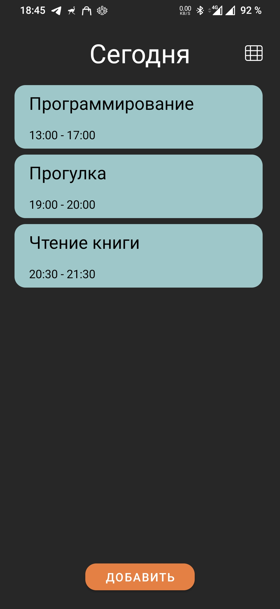
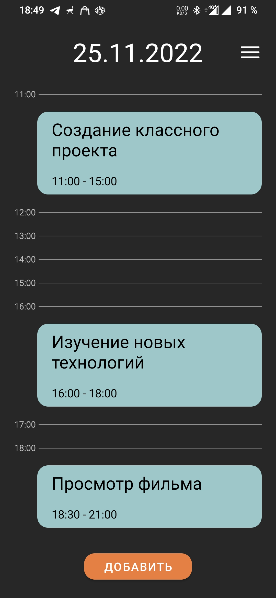
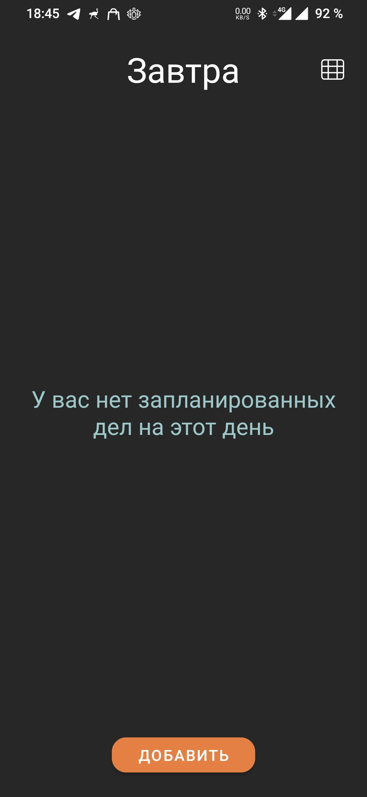
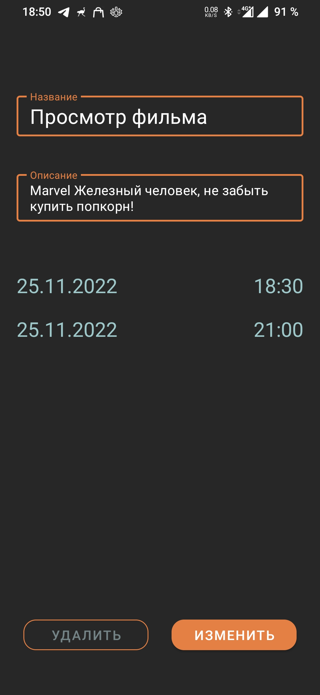
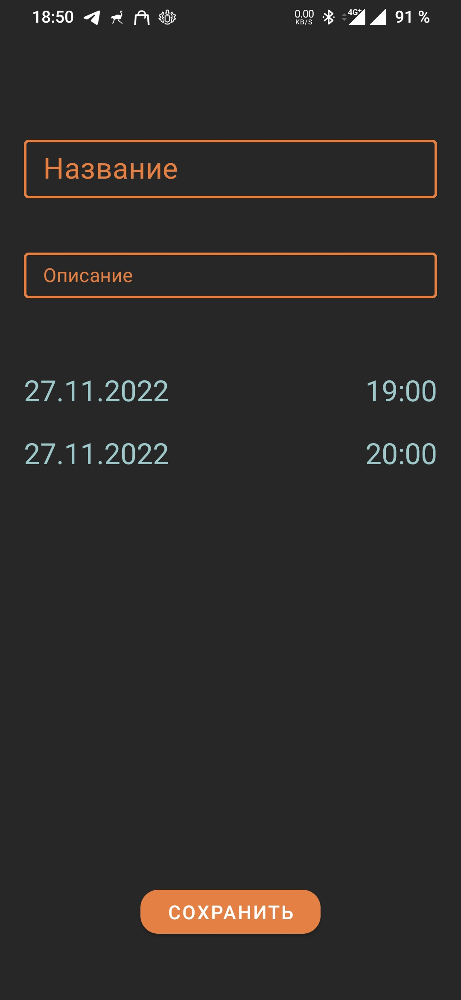

# Тестовое задание Simbirsoft Android
> Приложение представляет собой ежедневник, в котором можно быстро и удобно планировать свое расписание.
# Скриншоты приложения
| First Header  | Second Header | Second Header | Second Header | Second Header |
| ------------- | ------------- | ------------- | ------------- | ------------- |
|   |   |   |   |   |
# Описание
### Описание элементов приложения
> В приложении присутствуют 2 основных экрана: ***Список дел*** и ***Экран подробного описания дела***
> #### На первом экране располагаются:
>> + ***Cписок дел на выбранное число***
>> + ***Дата выбранного числа***
>> + ***Кнопка смены режима отображения***
>> + ***Кнопка добавления нового дела***
> #### На втором экране располагаются:
>> + ***Поле редактирования названия дела***
>> + ***Поле редактирования описания дела***
>> + ***Поля для планирования даты и времени***
>> + ***Кнопка сохранения*** или ***Кнопки удаления или изменения*** (В зависимости от перехода на данный экран)
### Инструкция по взаимодействию
> При запуске приложения открывается главный (первый) экран, на котором по умолчанию выбрана текущая дата устройства и отображен список дел пользователя на данную дату.  
> Для выбора другой даты предусмотрено два варианта:  
> + Нажатие на поле с датой и выбор в календаре новой даты
> + Свайпы от правого или левого края экрана устройства и последующие переходы на следующий или предыдущий день соответственно  
>
> Пользователю предоставлено два режима отображения списка дел: ***Список дел*** и ***Таблица дел с почасовыми ячейками***  
>
> Пользователь вправе выбрать удобный ему режим по кнопке в верхней части экрана справа, приложение запомнит данную настройку.
>
> При нажатии на кнопку "Добавить", пользователь перейдет ко 2 экрану, где по умолчанию будет выставлена дата прошлого экрана и время (старт: начало следующего часа, конец: + 1 час к старту)
>
> Заполнив необходимые настройки нового дела, пользователь может сохранить его, после чего приложение откроет главный экрана на дате соответствующий дате старта созданного дела
>
> Чтобы изменить данные уже существущего дела, необходимо в главном экране нажать на дело, после чего пользователь перейдет на второй экран, где у него будет возможность либо изменить либо удалить текущее дело
# Примечания
1. Для отображения дела в списке или таблице было создано кастомное View
2. Отображение дел в таблице по логике отличается от списка, чтобы не загрязнять интерфейс приложения (Фильтрация дела идет только по дате начала, когда в списке фильтрация дела происходит в диапазоне от начала, до конца)
3. Свайпы от края экрана для навигации по датам не будут работать, если они зарезервированны под конкретную оболочку Android (На стандартном эмуляторе Google Pixel 3 эти свайпы зарезервированны под действие "Назад") Однако, свайпы по прежнему будут работать в районе кнопки "Добавить" и в районе отображения даты  
# О проекте
> Архитектурный паттерн - MVVM
>
> Другие паттерны: Singlton, Adapter
>
> Технологии: ***Room***, ***Kotlin Coroutines***, ***Kotlin Flows***, ***ViewBinding***, ***SharedPreferences***, ***Navigation component***
>
> Реализация на языке: Kotlin
